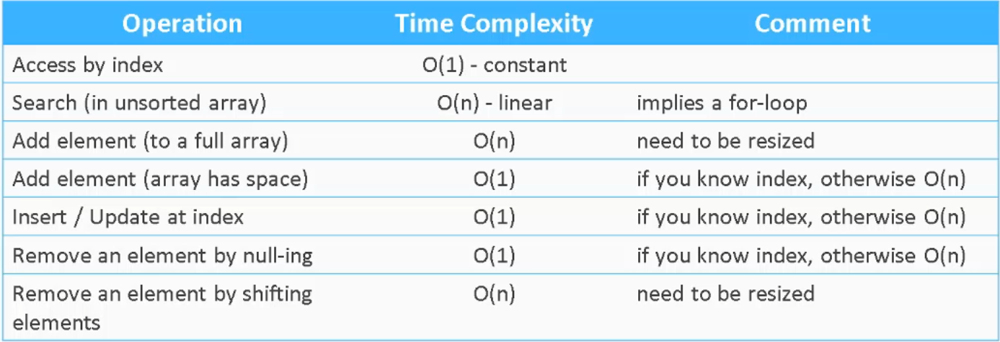

# C# Algorithms and Data Structures
This is a learning repository for the Udemy course Algorithms and Data Structures in C#: Complete Tutorial.

## Abstract Data Type vs. Data Structure
An abstract data type is a general term used to describe how data is organized and what operations can be performed on that data.

Data structures are the concrete implementations of a specific abstract data type.  For example, a _stack_ is a term used to 
describe an abstract data type which holds a list of values and can perform push, pop, and peek operations.  The Data Structure for 
how the data is stored and how those functions perform are what turns it into a data structure.

## Primitive Data Types
Primitive data types are the building blocks of larger data structures.  They consist of basic data types such as int, string, etc.

## Algorithm
An algorithm is defined as a computational procedure which has an input and an output.  An algorithm is correct for any input that produces a correct output.  They are often defined in psudeo-code and consumed by concrete programming languages.

To be complete, an algorithm includes:
* description of a correct input
* full description of the computation steps
* description of the correct output

## Time Complexity 
Most common operations:
* Accessing an element either directly or through a search process
* Adding an element; i.e. to the end or beginning
* Update an element
* Remove an element 

Array Time Complexity Table


## Algorithm Analysis
To infer growth of running time depending on the input size as a plot.  Large number require the use of log-log plots.  Input sizes are on the x-axis and running time is on the y-axis. 99% of the time we do not care of smaller terms compared to the larger terms.  We can trim smaller terms due to the nature of large inputs weighting more heavily on larger terms, i.e. N^3 has a much larger impact than N as input size grows larger.

We care mainly about two major factors: 
* Cost of executing each statement in a given program : rely heavily on external factors such as OS, execution environment, etc.  In today's computing environment this is not as prevelant.
* Frequency of execution of each statement in a given program : this has a larger impact on performance.

Order of growth falls into the following from largest to smallest:

|Type | Notation | Example |
| ---- | -------- | -------------------------------------------------- |
| Exponential | 2<sup>n</sup> | Time complexity of breaking a password|
| Cubic | N<sup>3</sup> | Three nested loops |
| Quadratic | N<sup>2</sup> | Two nested loops |
| Linearithmic | N log N | Commonly seen with divide and conquer approaches |
| Linear | N | Single loops |
| Logarithmic | log N | Binary search trees |
| Constant | 1 | Operations such as addition and subtraction |

## Big-O Notation (Asymptotic Notation)
Depending on the input, an algorithm can demonstrate the best, worst, and average cases.  We generally want to know the worst case running scenario to establish the minimal running time a program will spend performing an algorithm.

## Sorting

### Bubble Sort
Most likely you will never see the use of bubble sort since it does not have great performance.  Bubble sort works by tracking 3 things the ith elemnent, the i+1th element, and the wall which denotes sorted vs. unsorted.  Each loop of the array will compare the ith and i+1th element and leave the highest number in the correct place to the right.  Bubble sort is an in-place sorting method - this means that no additional storage (except the iterator) is needed for the calculation.  Bubble sort is a _Stable_ algorithm.  Stable means it does not change the relative order of the items - a number with the same value but smaller index will always be placed before the same value with a higher index.  Bubble sort has a quadractic time complexity, O(n<sup>2</sup>).  This means that performance degrades quickly.

### Selection Sort
In selection sort, we select either the largest or smallest value in each pass.  In each pass, we search for the largest value, and store the index of it.  At the end of the pass, we swap the biggest element with the last one.  Selection-sort is an in-place aglorithm.  The algorithm is Unstable.  This algorithm runs in O(n<sup>2</sup>) time complexity.  The algorithm degrades quickly, yet slower than Bubble Sort.

### Insertion Sort
Insertion sort works similarly to how you would sort cards in your hand. All the elements to the left of the wall are considered sorted with the wall starting to the right of the first element.  We save the initial value being sorted in a new value.  Insertion sort is an in-place, stable algorithm.  It runs in quadratic, O(n<sup>2</sup>) time.  It degrades quickly - if the input is already sorted, the running time will be linear.

#### Recursion
A recursive function is a function that calls itself.  A recursive function has a base case terminates recursive calls chain at the simplest unit of the algorithm. i.e. factorial - multiplication of numbers counting down from n to 1.  Recursive calls are slower due to memory allocation.  The depth of recursion is bound for recursive functions wheereas the iterative version is not.

Example:

```csharp
//Recursive Factorial
private static int RecursiveFactorial(int n){
    if(n==0)
        return 1;
    
    return n * RecursiveFactorial(n-1);
}
```

### Shell Sort
Shell sort is based on Insertion Sort.  Insertion sort runs fast on pre-sorted arrays.  Pre-sort the input and switch to Insertion Sort.  Gap is used for pre-sorting (swapping distant elements).  It starts with a large gap and gradually reduces it.  Once gap = 1, Insertion Sort finishes the sorting process.  Shell sort depends on a concrete gap value.   It 99% of cases can use a universal sequence of gap values. The goal of the gaps is to reduce the number of swaps that Insertion Sort needs to perform.  Shell sort is an in-place algorithm.  It is unstable. The running time is dependent on gap value that is used.  i.e. worst-case O(n^<sup>3/2</sup>) if sequence is (1/2(3<sup>k</sup>)-1).  On average will be O(n<sup>6/5</sup>).

1. Calculate max gap < N/3 where N is length of array.
2. Reduce the gap at the end of each step of the outer loop.

### Merge Sort
Merge sort belongs to the group of divide and conquer sorting solutions.  Two phases: splitting and merging.  Splitting provides an organized way to sequence the merges. Sibling arrays are split arrays with a size of 1.  *Not* an in-place algorithm, uses much memory (depending on n).  Merge sort is stable in the classic implementation.  Merge sort runs in O(nlogn) time complexity (linearithmic).

Steps:
1. Split the array (if array is odd, one will be bigger)
2. Continue splitting until each unit only has 1 elmenet.
3. Merge the array with the lowest value to the left and the larget to the right.
4.  Continue merging with comparisons from both of the arrays.

### Quick Sort
Quick sort is one of the best modern sorting algorithms.  It is another divide and conquer algorithm which is recursive.  Quick sort has 2 iterators i,j and a pivot, P.  Quick-sort is an in-place agorithm.  It runs in O(nlogn) time complexity (linearithmic).  The extremely rare case is that the data is reverse sorted in which it would run in O(n<sup>2</sup>) time complexity.  It is also unstable.

1. Increment J until we find an element that is less than P.
2. Increment I and swap elements i and j.
3. Repeat until j reaches the end of the array.
4. Exchange element P with element i.
5. Split array into two sub-arrays.
**The elements to the left of the pivot will be less that the pivot and the elements to the right will be greater than the pivot.**
6. Replay the algorithm recursively for each new sub-array.

### Lists
Lists are similar to arrays.  They live in the System.Collections.Generic namespace.  They have a bunch of methods that can be used to alter the lists.  Count and capacity are two of these values.  Count lists the number of items in the list, while capacity is the total number of items that can currently be in the list.  This means that the size of the list is dynamic.  Resizing is an expensive operation - that is why each time the list resizes, it doubles.  Removing items from an array does _not_ remove size from the list.  TrimExcess method can be used to decrease memory size.  The sort method sorts by descending values by default.  To sort by other member properties, you can use a lambda expresssion.  List sort calls Array sort internally.  If T is primitive, calls the TrySZSort().  If T is reference type, then check .net core and framework greater than 4.5 then run IntroSort() else run DepthLimitedQuickSort() unless 32 recursion depth, then run HeapSort().  Array.sort on average demonstrate linearithmic growth except in extremely rare cases where it could be quadratic.

List methods provide the following time complexities.

| Type | Complexity | Notes |
| ---- | -------- | -------------------------------------------------- |
| Add | O(1) if enough space, O(N) if not enough | |
| Remove | O(N) | Searching |
| RemoveAt | O(N) | Shifting |
| Reverse | O(N) | |
| ToArray | O(N) | based on Array.Copy |
| Contains, IndexOf, etc. | O(N) | Traversal of N elements |
| Sorting | O(nlogn) | O(n<sup>2</sup>) rare worst case |

### Linked Lists